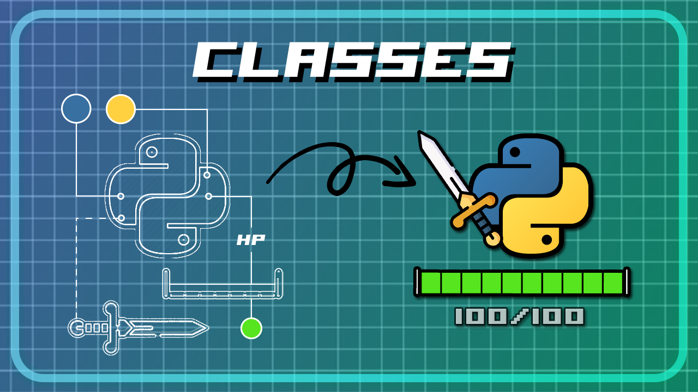

# Python Classes - Text-Based Battle Scene

My most recent and well-built tutorial about Object-Oriented Programming (OOP) in Python. All in a fun way of creating a text-based ASCII battle scene, featuring Character subclasses, different Weapons and dynamic HealthBars.

https://youtu.be/0e2DexQlDYk



## Playing over LAN

This project includes a simple TCP server and client to play with a friend on the same LAN.

- `net_server.py` — run on one machine that will host the match.
- `net_client.py` — run on each machine that will join (two players total).

Quick start:

1. On the host machine run:

```sh
python net_server.py
```

2. On each player machine run (replace <host-ip> with the server's LAN address):

```sh
python net_client.py <host-ip> 9999
```

3. Follow the prompts to enter your name, select a class and choose actions each round.

Notes and limitations:
- This is a minimal, educational implementation. It uses a line-delimited JSON protocol and expects exactly two clients.
- No reconnection, latency or cheating protections are implemented. Use only on trusted LANs.
Python Classes - Text-Based Battle Scene
===========================
My most recent and well-built tutorial about Object-Oriented Programming (OOP) in Python. All in a fun way of creating a text-based ASCII battle scene, featuring Character subclasses, different Weapons and dynamic HealthBars.

https://youtu.be/0e2DexQlDYk


